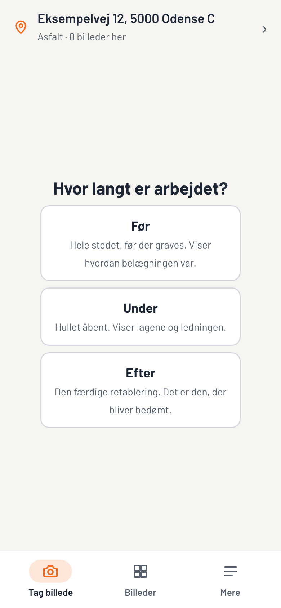
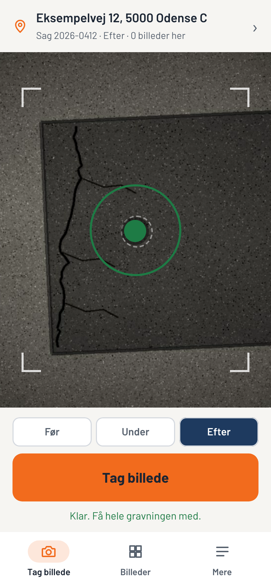
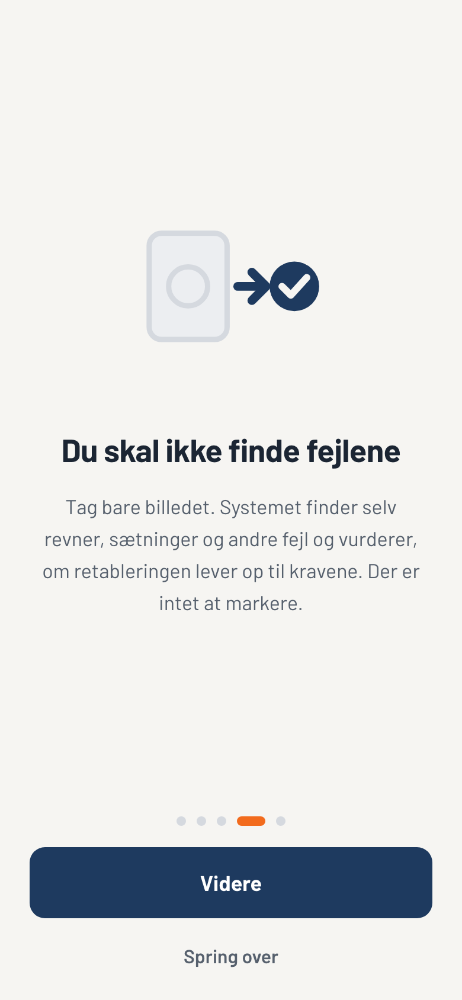
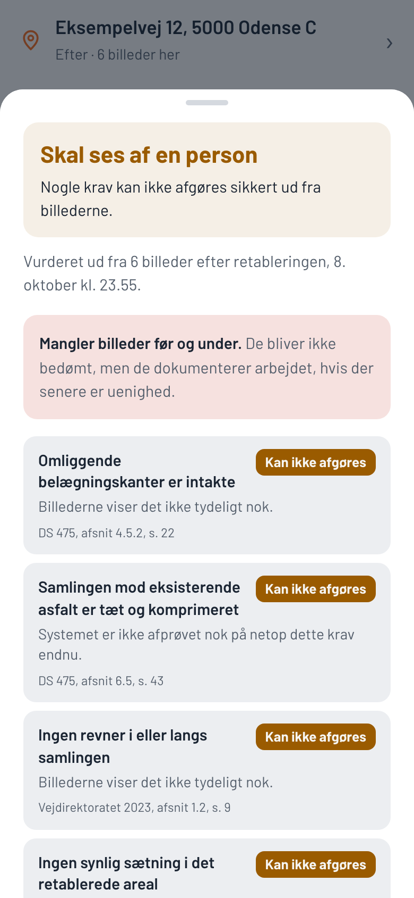
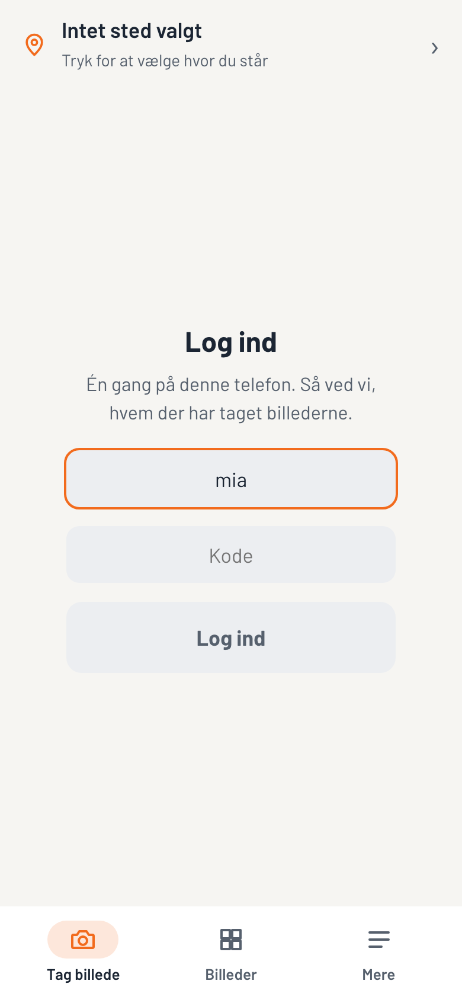
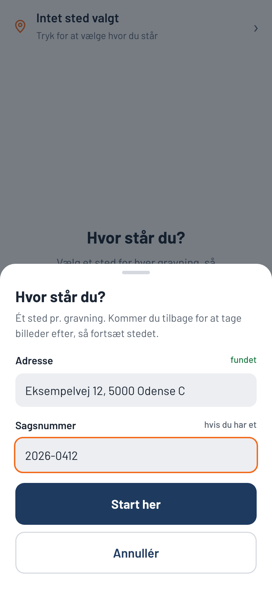
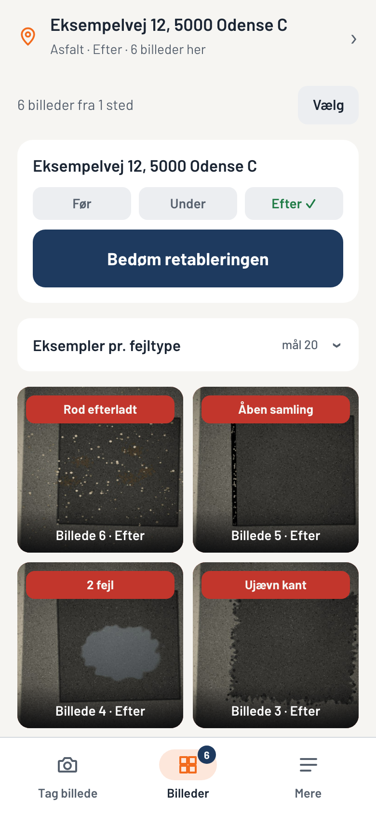
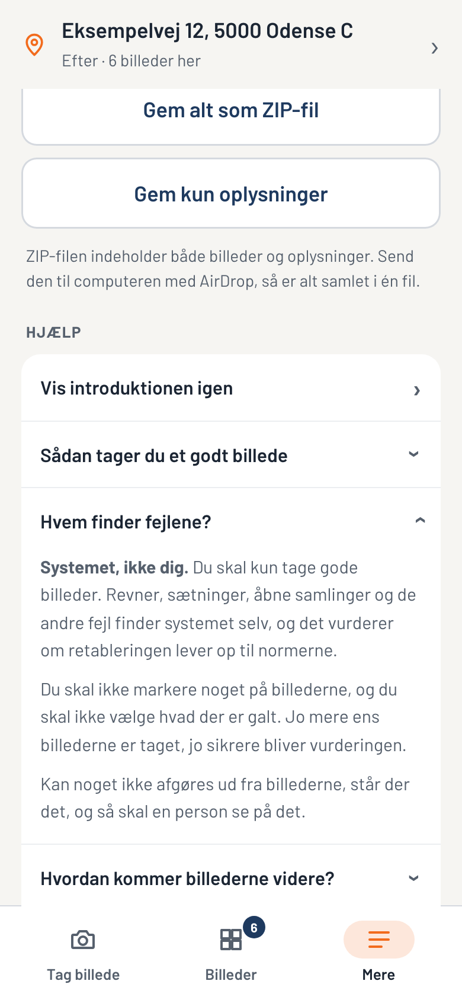
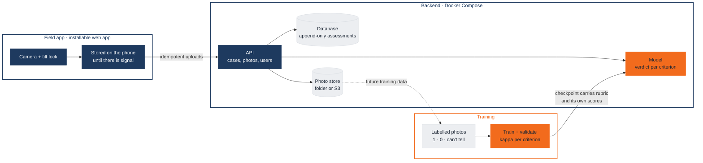

# Gravesyn

**Document every utility trench before, during and after, and check the finished
road repair against the Danish standards, from the phone.**

When a utility or fibre company digs up a road, the trench has to be re-surfaced
("retablering") to DS 475 and the Danish Road Directorate's requirements. Today
that is checked by a person on site, and disputes about who damaged what are
settled with whatever photos happen to exist. Gravesyn makes the documentation
systematic and checks the repair automatically, criterion by criterion, with
the clause in the standard each verdict rests on.

The app is only the gateway between the crew and the model: it takes good,
comparable photos and sends them. The crew is never asked what is wrong.
Finding defects and deciding whether the repair is good enough is the model's
job, so the quality assurance doesn't depend on who was on site.

This repository describes the product. The source code is proprietary and not
published; a live demo and, under an NDA, read access to the code are available
on request.

  
  
  
  

Before, during or after · level: ready · nothing to mark, the system finds the defects · assessment with its grounds

  
  
  
  

Captured from the app with a simulated camera, sensor and address; the trench images are generated.
The assessment shown is a real run of a model trained only on synthetic images, which is why it
leaves most criteria undecided.

## What it does

- **One case per excavation, in three phases.** *Before* shows the road as it was,
  which settles disputes about pre-existing damage. *During* shows the open
  trench and its layers. *After* is the finished repair, the part that is
  assessed. A site can be resumed days later, nearest site first.
- **Assessment with its grounds.** For each of the eight criteria a photo can
  decide: met, not met, or can't be decided, with the photo it rests on and the
  clause, e.g. "DS 475, afsnit 6.5, s. 43". The five criteria no photo can show
  (compaction, layer thickness, ...) are always listed, so a pass can't be read
  as more than it is.
- **An audit trail.** Every photo is stored with who took it, when, where, how
  level the phone was, and its SHA-256. Every assessment is stored unchanged,
  with the model version and the fingerprints of the photos it used.
- **Works without signal.** Photos are kept on the phone and sent when there is
  a connection. Nothing waits on the network while you work.
- **Built for road crews.** One step per screen, large buttons, no numbers or
  technical words on the main screen. The interface is in Danish.

## Architecture

| Part | Built with |
|---|---|
| Field app | React 19, TypeScript, Vite · Service Worker, IndexedDB |
| Backend | Python, FastAPI, PostgreSQL · photos in a folder or any S3-compatible bucket |
| Model | PyTorch, timm · ResNet-18 baseline and a Vision Transformer written from scratch |

The backend is stateless apart from a login throttle, so it scales out behind a
load balancer once photos are in object storage. It runs on any server with
Docker; no third-party service is required.

## How a verdict is justified

A verdict is only as good as the evidence for it:

- **The rubric comes from the standards.** 13 criteria, each tied to a section,
  page and quote in DS 475 or Road Directorate documents. 8 can be judged from
  a photo.
- **Unproven criteria are not judged.** The model only answers on a criterion
  where its agreement with a human grader (Cohen's kappa on held-out sites) is
  at least 0.4, measured on at least 20 photos. Elsewhere the answer is "can't
  be decided", never a guess.
- **The weakest photo decides.** A defect visible on any after-photo counts.
- **Overall:** one failed criterion fails the repair; one undecided criterion
  sends it to a person.
- **Three label states.** Training labels are pass, fail or "can't tell from
  this photo". The third is masked out of the loss, so the model doesn't learn
  to guess at things the image doesn't show.
- **Validation is split by site, never by photo,** so three photos of one hole
  can't inflate the scores. The app enforces a chosen site before any photo.

## Quality

| | |
|---|---|
| Field app | 14 unit tests · a browser test of the whole field session, with and without a server (22 and 26 steps) |
| Backend | 13 tests against a real PostgreSQL |
| Model | 13 tests, covering the masked loss and the assessment rules first |

Every repository runs its tests and a security scan (secret formats, personal
data, files that never belong in a repository) on every push.

## Status

- The app, backend and model pipeline are built and tested end to end.
- The app is in field testing with a small invited group.
- **The model is not yet trained on real photos.** It has been proven on
  synthetic images, where it reaches a validation kappa of 1.00 and 0.88 on
  edge and shoulder criteria. Real photos from the field are the next step, and
  until a criterion clears the threshold on real data the app says "can't be
  decided" for it.

## Demo and access

A live demo with a demo account is available on request, as is temporary read
access to the source code for due diligence under an NDA. Get in touch through
my GitHub profile.

## License

Proprietary, all rights reserved. See `LICENSE`.
